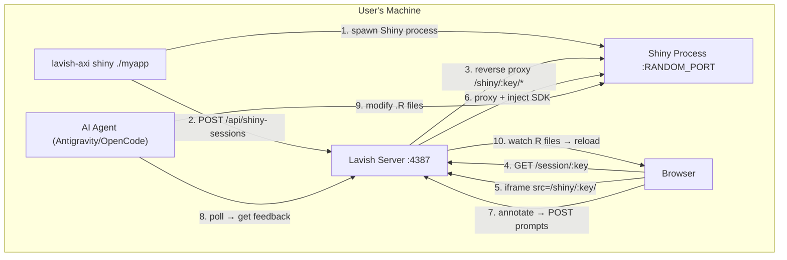

# Lavish Shiny: Interactive Annotation for R Shiny Apps

Extend lavish-axi with a `shiny` command that launches a Shiny app, reverse-proxies it through lavish's chrome shell, injects the annotation SDK, and feeds user annotations back to an AI agent for code modifications — the same open/annotate/poll loop that works for static HTML, but for live, reactive Shiny apps.

## User Review Required

> [!IMPORTANT]
> **Scope decision**: This plan extends the existing `lavish-axi` CLI/server codebase with a new `shiny` command plus a new agent skill (`skills/lavish-shiny/SKILL.md`). It does **not** create a separate npm package.

> [!WARNING]
> **New dependency**: This adds `http-proxy` (~3.5 KB min) for reverse-proxying HTTP + WebSocket traffic from the Shiny app. The alternative is hand-rolling proxy logic with `node:http`, which is possible but fragile for WebSocket upgrade handling.

> [!IMPORTANT]
> **R requirement**: The user must have R and the `shiny` package installed. The CLI will validate this at startup and provide clear error messages if missing. We do NOT bundle R.

## Open Questions

> [!IMPORTANT]
> **Q1: Shiny app launch strategy** — Should `lavish-axi shiny .` auto-detect whether to run `Rscript -e 'shiny::runApp(".")'` vs. expect the user to start Shiny themselves and pass a URL?
>
> **Proposed**: Default to auto-launching Shiny (managed mode). Also support `lavish-axi shiny --url http://localhost:3838` for pre-running apps (attached mode). This covers both quick iteration and complex setups (e.g., apps with database deps).

> [!IMPORTANT]
> **Q2: SDK injection approach** — Two options for injecting the annotation SDK into Shiny's HTML responses:
>
> | Approach                                  | Pros                                               | Cons                                                                      |
> | ----------------------------------------- | -------------------------------------------------- | ------------------------------------------------------------------------- |
> | **A. HTTP response rewriting** (proposed) | Works with any Shiny app, no R code changes needed | Requires parsing/buffering responses, slightly more complex proxy         |
> | **B. Shiny `www/` script injection**      | Simple, uses Shiny's own mechanism                 | Requires modifying the user's app directory, breaks "zero config" promise |
>
> **Proposed**: Approach A — intercept the initial HTML response from Shiny and inject the SDK `<script>` tag, just like `injectLavishSdk` does for static files. The proxy buffers only `text/html` responses.

> [!NOTE]
> **Q3: Annotation target mapping** — When the user annotates a Shiny component, we need to help the agent understand _which R code_ to modify. Shiny's DOM has predictable patterns (e.g., `<div id="myPlot" class="shiny-plot-output">` maps to `plotOutput("myPlot")` in ui.R and `output$myPlot <- renderPlot(...)` in server.R). The SDK's existing `selector` + `tag` + `text` context is a good start. The new skill's prompt guidance will teach agents to map DOM IDs to R source patterns. No additional SDK changes needed in Phase 1.

## Architecture Overview



### Key Differences from Static HTML Flow

| Aspect                  | HTML Artifact                                            | Shiny App                                                                                                          |
| ----------------------- | -------------------------------------------------------- | ------------------------------------------------------------------------------------------------------------------ |
| **Content source**      | Read file from disk                                      | Reverse-proxy from live Shiny server                                                                               |
| **Session key**         | `sha256(canonical_file_path)`                            | `sha256(canonical_app_dir)`                                                                                        |
| **SDK injection**       | String replace in HTML before serving                    | Intercept proxy response, inject into `</body>`                                                                    |
| **iframe sandbox**      | `allow-scripts allow-forms allow-popups allow-downloads` | `allow-scripts allow-forms allow-popups allow-downloads allow-same-origin` (Shiny needs same-origin for WebSocket) |
| **Live reload trigger** | Chokidar watches `.html` file                            | Chokidar watches app directory for `.R`/`.css`/`.js` changes                                                       |
| **Reload mechanism**    | iframe `src` reassign                                    | Shiny auto-reload OR iframe `src` reassign                                                                         |
| **Process lifecycle**   | None (static file)                                       | Managed child process (spawn/kill Shiny)                                                                           |
| **Asset serving**       | `resolveArtifactAsset` from file's dir                   | All proxied through Shiny's own server                                                                             |

## Proposed Changes

### Component 1: Shiny Process Manager

New module that handles spawning, health-checking, and terminating the R/Shiny process.

---

#### [NEW] [shiny-process.js](file:///Users/freeman/workspace/lavish-axi/src/shiny-process.js)

Manages the Shiny child process lifecycle:

```js
// Core API shape:
export async function launchShiny(appDir, { port, host, onReady, onExit, signal })
// - Spawns: Rscript -e 'options(shiny.autoreload=FALSE); shiny::runApp(".", port=PORT, host="127.0.0.1", launch.browser=FALSE)'
// - Polls http://127.0.0.1:PORT until Shiny responds (up to 30s timeout)
// - Returns { process, port, url, kill() }

export function findFreePort()
// - Binds port 0, reads assigned port, closes — standard Node trick

export function detectRscript()
// - Checks `Rscript --version` is available on PATH
// - Returns { ok: true, version } or { ok: false, error }
```

**Key design decisions:**

- `shiny.autoreload=FALSE` — we handle reload ourselves via chokidar + SSE, to avoid Shiny's internal reload conflicting with our iframe reload
- The Shiny process is a **child** of the lavish server process (not fully detached like the server itself), so it dies when the server shuts down
- stdout/stderr from the Shiny process are logged to `server.log` with a `[shiny]` prefix

---

### Component 2: Reverse Proxy with SDK Injection

New module for proxying Shiny traffic and injecting the annotation SDK into HTML responses.

---

#### [NEW] [shiny-proxy.js](file:///Users/freeman/workspace/lavish-axi/src/shiny-proxy.js)

Reverse proxy middleware for Express that forwards requests to the Shiny backend:

```js
export function createShinyProxy(shinyUrl, sessionKey)
// Returns an Express router that:
//
// 1. Proxies all HTTP requests from /shiny/:key/* → shinyUrl/*
//    - For text/html responses: buffers the body, runs injectLavishSdk(), forwards
//    - For all other responses: streams through unchanged
//    - Strips X-Frame-Options headers (Shiny Server sets these, local runApp usually doesn't)
//
// 2. Handles WebSocket upgrade on the same path prefix
//    - Shiny uses WebSocket for ALL reactivity (input changes, output updates)
//    - The proxy must handle HTTP Upgrade → forward to Shiny's WS endpoint
//    - Uses http-proxy's `ws: true` or manual upgrade handling
//
// 3. Rewrites asset URLs in proxied HTML so relative paths resolve correctly
//    - Shiny serves assets from /shared/, /session/<hash>/, and the app's www/
//    - These must all route through the proxy prefix
```

**Why `http-proxy`**: WebSocket upgrade handling is notoriously tricky. `http-proxy` handles the `Upgrade` header, socket piping, and error recovery correctly. The alternative (manual `http.request` + socket piping) is ~100 lines of fragile code.

**SDK injection in proxy** (not in the static injection path):

```js
// Intercept the initial HTML response from Shiny
function injectSdkIntoProxiedResponse(proxyRes, req, res, key) {
  const contentType = proxyRes.headers["content-type"] || "";
  if (!contentType.includes("text/html")) {
    // Stream through unchanged
    proxyRes.pipe(res);
    return;
  }
  // Buffer the HTML, inject SDK, send
  let body = "";
  proxyRes.on("data", (chunk) => (body += chunk));
  proxyRes.on("end", () => {
    res.end(injectLavishSdk(body, key));
  });
}
```

---

### Component 3: Server Extensions

Extend the existing server to handle Shiny sessions alongside HTML artifact sessions.

---

#### [MODIFY] [server.js](file:///Users/freeman/workspace/lavish-axi/src/server.js)

**New routes added:**

1. **`POST /api/shiny-sessions`** — Create a Shiny session
   - Receives `{ appDir: "/path/to/shiny/app" }` or `{ url: "http://localhost:3838" }`
   - For managed mode: calls `launchShiny()` from shiny-process.js
   - For attached mode: validates the URL is reachable
   - Creates a session with `type: "shiny"`, stores the Shiny backend URL and app directory
   - Mounts the proxy router at `/shiny/:key/`
   - Sets up chokidar to watch the app directory for `.R`, `.js`, `.css`, `.html` changes
   - Returns `{ key, url: "http://127.0.0.1:PORT/session/:key" }`

2. **`GET /session/:key` (modified)** — Serve chrome page
   - Checks session type. If `type === "shiny"`:
     - `createChromeHtml` gets an iframe `src` of `/shiny/:key/` instead of `/artifact/:key/index.html`
     - The iframe `sandbox` attribute adds `allow-same-origin` (required for Shiny's WebSocket)
   - If `type === "html"` (default): unchanged behavior

3. **WebSocket upgrade handling** — The Express server's underlying `http.Server` needs a `upgrade` listener:

   ```js
   httpServer.on("upgrade", (req, socket, head) => {
     // Match /shiny/:key/ prefix → forward to the Shiny backend's WS
     const match = req.url.match(/^\/shiny\/([^/]+)\//);
     if (match) {
       const session = store.findByKeySync(match[1]); // or async lookup
       if (session?.shinyUrl) proxy.ws(req, socket, head, { target: session.shinyUrl });
     }
   });
   ```

4. **Shiny process cleanup** — On server shutdown, kill all managed Shiny child processes.

**Changes to `createChromeHtml`:**

- Accept a `sessionType` parameter
- When `sessionType === "shiny"`:
  - Change iframe `sandbox` to include `allow-same-origin`
  - Change iframe `src` to `/shiny/${session.key}/`
  - Add visual indicator in the chrome bar (e.g., "Shiny App" badge next to the file path)
  - Change "Reload artifact" → "Reload app"

**Changes to `watchSession`:**

- For Shiny sessions, always watch the app directory recursively (not opt-in)
- Watch patterns: `**/*.R`, `**/*.r`, `www/**`, `*.css`, `*.js`, `*.html`
- Ignore: `.git`, `node_modules`, `.Rproj.user`, `rsconnect`, `.Rhistory`

---

#### [MODIFY] [session-store.js](file:///Users/freeman/workspace/lavish-axi/src/session-store.js)

Extend the session shape to support Shiny sessions:

```js
// New session fields for type="shiny":
{
  key,
  type: "shiny",        // NEW — "html" (default) or "shiny"
  file: appDir,          // the app directory (canonical path)
  shinyUrl: "http://127.0.0.1:RANDOM_PORT",  // NEW — backend URL
  shinyPid: 12345,       // NEW — child process PID (null for attached mode)
  url,                   // session URL in lavish chrome
  status, pending_prompts, prompts, dom_snapshot, chat, updated_at
}
```

The `sessionKey` function works unchanged — it hashes the canonical app directory path instead of a file path.

`canonicalFile` is renamed or aliased to `canonicalPath` to better reflect its dual use (file or directory).

---

### Component 4: CLI Extensions

Add the `shiny` command to the CLI.

---

#### [MODIFY] [cli.js](file:///Users/freeman/workspace/lavish-axi/src/cli.js)

**New command: `shinyCommand`**

```
lavish-axi shiny [app-dir]              # managed mode: launch & proxy
lavish-axi shiny --url http://host:port # attached mode: proxy existing app
lavish-axi shiny [app-dir] --no-open    # suppress browser launch
```

Implementation:

1. **Validate R environment**: Call `detectRscript()`. If R is missing, throw `AxiError` with install guidance.
2. **Validate app directory**: Check that `app-dir` contains `app.R`, or both `ui.R` + `server.R`. If `--url` is provided, skip this.
3. **Resolve canonical path**: `canonicalPath(appDir)` (works on directories too via `realpath`).
4. **Ensure server**: Same `ensureServer()` flow as `openCommand`.
5. **POST `/api/shiny-sessions`**: Send `{ appDir }` or `{ url }`.
6. **Open browser**: Same as `openCommand`.
7. **Return output**:
   ```js
   {
     session: { app: appDir, url, status: "opened", type: "shiny" },
     next_step: "Run `lavish-axi poll <app-dir>` to wait for user feedback..."
   }
   ```

**`normalizeArgv` changes:**

- Recognize `shiny` as a command name (add to `COMMANDS` set)
- No auto-detection: user must explicitly type `lavish-axi shiny`

**`pollCommand` changes:**

- Works unchanged! The poll is keyed by the canonical path (file or directory). The Shiny session key is just `sessionKey(canonicalPath(appDir))`.
- The `next_step` text adapts based on session type (tells agent to modify `.R` files, not `.html`).

**`endCommand` changes:**

- For Shiny sessions: also kill the managed Shiny process.

---

### Component 5: Shiny Agent Skill

A new skill that teaches agents how to work with the Shiny annotation workflow.

---

#### [NEW] [SKILL.md](file:///Users/freeman/workspace/lavish-axi/skills/lavish-shiny/SKILL.md)

Key sections:

1. **When to use**: User has an R Shiny app project and wants interactive visual feedback
2. **Workflow**:

   ```
   1. lavish-axi shiny ./myapp          # launches Shiny, opens in browser
   2. lavish-axi poll ./myapp           # wait for user feedback
   3. [user annotates components in browser]
   4. [agent receives feedback with DOM snapshot + prompts]
   5. [agent modifies .R files based on annotations]
   6. [chokidar detects changes → browser reloads]
   7. lavish-axi poll ./myapp --agent-reply "Updated the plot colors"
   ```

3. **Mapping annotations to R source code**:
   - DOM `id` attributes directly map to Shiny output/input IDs
   - `<div id="myPlot" class="shiny-plot-output">` → `output$myPlot` in `server.R` + `plotOutput("myPlot")` in `ui.R`
   - `<div class="shiny-input-container"><input id="slider1">` → `sliderInput("slider1", ...)` in `ui.R`
   - Layout annotations (sidebar, tabs) → `sidebarLayout()`, `tabsetPanel()` in `ui.R`

4. **Shiny-specific guidance**:
   - Understand the separation of `ui.R` (layout/appearance) vs `server.R` (logic/data)
   - When user annotates an output, check both the `render*()` function in server.R and the `*Output()` call in ui.R
   - For styling changes, prefer CSS in `www/styles.css` over inline R changes
   - For layout changes, modify the `ui.R` / `app.R` UI definition

5. **Common annotation patterns**:

   ```
   User annotates a plot → "Make this a bar chart instead of a line chart"
   → Agent modifies renderPlot() in server.R

   User annotates the sidebar → "Add a date range selector"
   → Agent adds dateRangeInput() in ui.R, updates server.R reactive logic

   User annotates a table → "Sort by the second column descending"
   → Agent modifies renderTable() or renderDT() in server.R
   ```

---

### Component 6: Tests

---

#### [NEW] [shiny-process.test.js](file:///Users/freeman/workspace/lavish-axi/test/shiny-process.test.js)

- Test `findFreePort()` returns a valid port
- Test `detectRscript()` with mocked `spawnSync`
- Test `launchShiny()` spawns the correct command with correct args
- Test process cleanup on `kill()`

#### [NEW] [shiny-proxy.test.js](file:///Users/freeman/workspace/lavish-axi/test/shiny-proxy.test.js)

- Test SDK injection into proxied HTML responses
- Test non-HTML responses pass through unchanged
- Test `X-Frame-Options` stripping
- Test URL path rewriting

#### [MODIFY] [server.test.js](file:///Users/freeman/workspace/lavish-axi/test/server.test.js)

- Add tests for `POST /api/shiny-sessions` (with a mock Shiny backend)
- Test Shiny chrome HTML has correct iframe sandbox attributes
- Test Shiny session type stored correctly

#### [MODIFY] [cli-output.test.js](file:///Users/freeman/workspace/lavish-axi/test/cli-output.test.js)

- Test `normalizeArgv` recognizes `shiny` command
- Test `createShinyOpenOutput` structure
- Test poll output for Shiny sessions

---

## Implementation Order

| Phase | Files                          | Description                                                         |
| ----- | ------------------------------ | ------------------------------------------------------------------- |
| **1** | `src/shiny-process.js` + tests | Shiny process lifecycle (spawn, health-check, kill)                 |
| **2** | `src/shiny-proxy.js` + tests   | Reverse proxy with SDK injection + WebSocket forwarding             |
| **3** | `src/session-store.js`         | Extend session shape with `type`, `shinyUrl`, `shinyPid`            |
| **4** | `src/server.js`                | New routes, chrome HTML changes, WebSocket upgrade, watcher changes |
| **5** | `src/cli.js`                   | `shinyCommand`, normalizeArgv, end/poll adaptations                 |
| **6** | `skills/lavish-shiny/SKILL.md` | Agent skill with R/Shiny mapping guidance                           |
| **7** | Integration testing            | End-to-end test with a real Shiny app                               |

## Verification Plan

### Automated Tests

```bash
# Unit tests for new modules
node --test test/shiny-process.test.js
node --test test/shiny-proxy.test.js

# Full test suite
pnpm test

# Lint, format, typecheck
pnpm run check
```

### Manual Verification

1. Create a minimal Shiny app (`app.R` with a plot + input)
2. Run `lavish-axi shiny ./test-app` — verify:
   - Shiny process spawns correctly
   - Browser opens the lavish chrome with the Shiny app in the iframe
   - Shiny's reactivity works (move sliders, see plots update)
   - Annotation mode works (hover highlights, click opens annotation card)
3. Annotate a plot element, type "Make this red", send to agent
4. Run `lavish-axi poll ./test-app` — verify feedback arrives with DOM snapshot
5. Modify the `.R` file — verify browser reloads with changes
6. Run `lavish-axi end ./test-app` — verify Shiny process is killed
7. Test `--url` mode with a pre-running Shiny app
