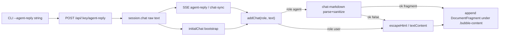

# Markdown Agent-Reply Bubbles - Plan

## Goal Capsule

- **Objective:** Render Markdown already present in `--agent-reply` chat text as safe, readable formatting inside agent bubbles in the Lavish chrome Conversation panel, without changing the poll protocol, storage schema, or authoring format.
- **Authority:** This plan > scout report recommendation (Option A) > existing chrome XSS boundary (`escapeHtml` today).
- **Execution profile:** code; small client-only presentation feature; TDD on the markdown/security module first.
- **Stop conditions:** Any design that stores generated HTML, changes `/api/:key/agent-reply` or chat schema, adds a structured rich-reply protocol, or fails open to unsanitized HTML (including assigning parser/sanitizer **string** output via `innerHTML` on the agent path) is out of scope — stop and re-plan.
- **Tail ownership:** Implementer lands units in dependency order; firstmate owns review/shipping after plan commit.

---

## Product Contract

### Summary

Agent replies already travel end-to-end as raw strings (`--agent-reply` → POST → `session.chat[]` → SSE `agent-reply` / `chat-sync` / `initialChat` → `addChat`). Display currently escapes them to plain text, so `**bold**`, lists, and newlines collapse or show literally. This work adds client-side Markdown rendering at display time for `role === "agent"` only, keeping raw Markdown canonical in storage.

### Problem Frame

Reviewers read multi-line agent replies with emphasis and structure as dense escaped text. The data path already preserves newlines and Markdown characters; only the final DOM insertion strips meaning. Security must stay at least as strong as today's escape-everything path because replies land in the privileged chrome page, not the sandboxed artifact iframe.

### Requirements

**Rendering**

- R1. Agent bubbles render common Markdown already present in `chat[].text`: bold, italic, inline code, links, paragraphs, newline-as-break behavior, ordered/unordered lists, and unhighlighted fenced code blocks.
- R2. Headings in v1 are **stripped of heading tags** (no `h1`–`h6` elements and no document-scale heading CSS); heading text remains readable as ordinary bubble text (sanitizer allowlist omission or equivalent).
- R3. Live SSE `agent-reply`, reconnect `chat-sync`, and bootstrap `initialChat` all produce the same formatted agent DOM because they already converge on `addChat`.
- R4. Historical agent replies in persisted `session.chat` become formatted automatically on next open (no migration).

**Safety**

- R5. Raw HTML, dangerous link schemes, event handlers, and disallowed tags/attributes never execute or persist as active DOM in the chrome.
- R6. If parsing or sanitization cannot produce a safe rich result, fall back to the current escaped plain-text renderer — never fail open to unsanitized HTML, and never assign parser/sanitizer HTML **strings** via `innerHTML` on the agent path.
- R7. User bubbles remain escaped plain text in v1.

**Non-goals as product constraints**

- R8. Do not store generated HTML. Do not change poll/agent-reply/session-store contracts. Do not introduce a structured rich-reply AST protocol.

### Actors

- A1. Human reviewer — reads agent replies in the Conversation panel.
- A2. Agent — continues sending plain `--agent-reply "..."` strings (may already include Markdown).
- A3. Implementer — lands the client presentation change behind tests.

### Key Flows

- F1. Live agent reply
  - **Trigger:** `lavish-axi poll … --agent-reply "…"` succeeds.
  - **Steps:** Server stores raw text; SSE `agent-reply` delivers `{ text }`; chrome `addChat("agent", text)` renders safe Markdown.
  - **Outcome:** Formatted agent bubble; storage still raw Markdown.
- F2. Reconnect / reload
  - **Trigger:** SSE reconnect (`chat-sync`) or full chrome load (`initialChat`).
  - **Steps:** Same `addChat` path with `role`/`text` from persisted chat.
  - **Outcome:** Identical formatting to F1 for the same text.
- F3. Hostile payload
  - **Trigger:** Agent or state file contains HTML/script or `javascript:` links in reply text.
  - **Steps:** Parse → sanitize → attach `DocumentFragment` (or plain-text fallback); disallowed content stripped or neutralized.
  - **Outcome:** No script execution; safe residual text or links only.

### Acceptance Examples

- AE1. Covers R1, F1. Given agent text `**bold** and \`code\``, when the bubble renders, bold and mono code appear (not literal asterisks/backticks as the only presentation).
- AE2. Covers R1. Given a multi-line reply with blank lines and single newlines, paragraphs and breaks remain readable (newlines are not collapsed to a single dense line).
- AE3. Covers R5, F3. Given text containing `<script>alert(1)</script>` or a Markdown link to `javascript:alert(1)`, when rendered, nothing executes and the dangerous href is not an active javascript navigation.
- AE4. Covers R3, R4, F2. Given the same agent text via live SSE, `chat-sync`, and `initialChat`, the visible formatting matches across paths.
- AE5. Covers R7. Given a user message containing `**not bold**`, the user bubble still shows literal asterisks as escaped text.

### Success Criteria

- Agent Markdown in the scout's real conversation examples (lists, bold, multi-paragraph) is readable in-bubble.
- XSS/fail-closed tests for the markdown module pass.
- `pnpm run check` passes under Node 22+.
- No API, poll, or `state.json` chat-schema change.

### Scope Boundaries

**In scope**

- `src/chat-markdown.js` (new): parse, sanitize, safe-link policy, plain-text fallback; single locked return contract (see KTD10).
- Thin agent-only branch in `src/chrome-client.js` `addChat` that attaches a `DocumentFragment` (or plain-text fallback) — no agent-path `innerHTML` of Markdown output.
- Bundle full chrome client IIFE so npm parser/sanitizer ship in the browser asset (see KTD6); U4 owns harness migration to the built asset.
- Server path resolution so packaged and source runs serve the built chrome client; `Cache-Control: no-cache` on `GET /chrome-client.js`.
- `THIRD-PARTY-NOTICES.md` section for packages bundled into `dist/chrome-client.js`.
- Compact `.bubble-content` typography in `src/chrome.css`.
- Focused unit + thin delivery-path integration tests; Node unit tests use **jsdom** for a real `window`/`document`.
- Trusted post-sanitize link defaults: `rel="noopener noreferrer"` and `target="_blank"` on allowed anchors.

**Deferred for later**

- Markdown for user bubbles.
- Syntax highlighting in fenced code.
- Images, blockquotes, tables, task lists, heading hierarchy styling (unsupported constructs degrade to plain text content via tag strip / text preserve — not errors).
- Separate browser asset for markdown only (rejected for v1; see Alternatives).

**Outside this product's identity**

- Server-side HTML generation or HTML persistence.
- Structured rich-reply protocol / JSON AST for agent messages.
- Artifact-iframe Markdown (artifacts already choose their own HTML).

**Deferred to follow-up work**

- README one-liner that agent replies may include Markdown (optional docs polish; behavior is display-only).

---

## Planning Contract

### Assumptions

- Scout Option A is authoritative: client-side display-time Markdown for agent role only.
- Direct runtime deps `marked` and `dompurify` (or the repo's chosen maintained equivalents with the same roles) are added explicitly; transitive Mermaid-graph copies are not a supported import surface.
- Pipeline mode locked the scout's recommended library path over a homegrown tokenizer.
- **v1 link open default:** trusted post-sanitize code sets `target="_blank"` **and** `rel="noopener noreferrer"` on every allowed anchor. These attributes are never accepted from Markdown input (sanitizer strips attacker-controlled `target`/`rel`; trusted code re-applies).
- Relative/protocol-relative link hrefs are rejected in v1 (session URL base is ambiguous).
- **`mailto:` is out of v1** allowlist (http/https only) so scheme tests stay tight; can be added later with positive + abuse cases.
- **Node unit tests** construct a DOM with devDependency **jsdom** and pass `{ window, document }` into the module (or set globals for DOMPurify as required by the library).
- Static analysis tests that read `src/chrome-client.js` remain valid for chrome orchestration patterns; **served** bytes come from `dist/chrome-client.js` after build — do not assume src≡served for import/bundle markers.

### Key Technical Decisions

- KTD1. **Canonical source stays raw Markdown in `chat[].text`.** Re-render on every display path. Rationale: no schema/versioning, old history upgrades automatically, sanitizer improvements apply retroactively.
- KTD2. **`src/chat-markdown.js` is the single policy owner.** Parser options, tag/attr allowlist, URL scheme rules, link defaults, and escaped-text fallback live only there. `chrome-client` chooses the renderer by role and attaches the safe result — no Markdown/security policy in the chrome orchestrator.
- KTD3. **Parse then sanitize immediately before DOM use; attach DOM nodes, not HTML strings.** Disable/escape raw HTML in the parser as defense-in-depth; still sanitize parser output (prefer DOMPurify `RETURN_DOM_FRAGMENT` / equivalent). Suggested v1 allowlist: tags `p`, `br`, `strong`, `em`, `code`, `pre`, `ul`, `ol`, `li`, `a`; attrs limited (e.g. `href`, `title` on `a` only before trusted rewrite). Links: `http:` and `https:` only in v1; reject `mailto:`, `javascript:`, `data:`, `file:`, unknown schemes, and relative/protocol-relative URLs. After sanitize, trusted code sets `rel="noopener noreferrer"` and `target="_blank"` on allowed anchors.
- KTD4. **Headings: strip heading tags, keep text** (via sanitizer allowlist omission or equivalent), not full heading styling and not compact styled `h*` elements.
- KTD5. **Newlines: enable breaks-true (or equivalent)** so single newlines in agent replies remain readable near-Markdown, matching scout recommendation.
- KTD6. **Bundle `src/chrome-client.js` with esbuild to a browser IIFE** at `dist/chrome-client.js` (mirror whiteboard frame pattern in `scripts/build.js`), replacing the verbatim `copyFile` of the chrome client. CSS can remain a copy. **Rejected alternative:** separate `dist/chat-markdown.js` + global hook while leaving chrome-client as a copy — fewer harness edits, but two scripts, dual versioning, and weaker single-asset packaging; full chrome IIFE accepted, with U4 owning harness migration.
- KTD7. **Serve the built chrome client with packaged-vs-source resolution** analogous to `defaultWhiteboardAssetsDir`: next to the running module when present (packaged `dist/`), else repo `dist/chrome-client.js` for source runs after `pnpm run build`. Do not serve raw `src/chrome-client.js` once it has npm imports. Set **`Cache-Control: no-cache`** on `GET /chrome-client.js` (same rationale as whiteboard assets: unversioned URL must not sticky-cache a stale sanitizer bundle).
- KTD8. **Agent-only branch in `addChat`.** User path keeps `escapeHtml` / text into the content container. Prefer a stable content wrapper class (e.g. `.bubble-content`) for both roles so CSS and tests share one markup contract. Agent success path: `content.replaceChildren(fragment)` or `appendChild` of the module’s `DocumentFragment` — **never** `innerHTML = sanitizedHtmlString` for agent Markdown.
- KTD9. **Fail closed on renderer failure.** Any throw/unavailable sanitizer/window → escaped plain text content via `textContent` or existing `escapeHtml` into the content node, same safety as today. Prefer the module return shape in KTD10 so chrome does not need try/catch around policy — still catch unexpected throws as a last resort.
- KTD10. **Locked public render API (single shape):**

  ```js
  /**
   * @param {string} text
   * @param {{ document: Document, window?: Window }} env
   * @returns {{ ok: true, node: DocumentFragment } | { ok: false, plainText: string }}
   */
  export function renderAgentChatMarkdown(text, env)
  ```

  - `ok: true` — `node` is a sanitizer-produced `DocumentFragment` ready for `appendChild`/`replaceChildren`; chrome must not re-parse it as HTML.
  - `ok: false` — `plainText` is the original (or safely stringified) text for the plain escaped/`textContent` path; never treat `plainText` as HTML.
  - Empty input: return a no-op signal consistent with `addChat`'s `if (!text) return` (either early return in chrome before calling, or `ok: false` with empty plainText — pick one in U1 and stick to it).

- KTD11. **Node test DOM = jsdom.** Add `jsdom` as a **devDependency**. `test/chat-markdown.test.js` creates a window/document per case (or shared fixture) and passes them into `renderAgentChatMarkdown`. Do not invent a partial fake DOM that claims DOMPurify parity.

### High-Level Technical Design



Delivery paths stay protocol-identical; only the agent display branch changes.

### Sequencing

1. U1 markdown module + security/format tests (TDD) — **API shape frozen here**.
2. U2 deps + chrome-client bundle + server serve path + notices + cache-control.
3. U3 `addChat` wiring + bubble CSS.
4. U4 delivery-path integration + build/serve contract assertions (load **built IIFE** in chrome harness).

U2 may start once U1's public render API shape is stable (KTD10); U3 depends on U1+U2; U4 depends on U3.

### Patterns to Follow

- Whiteboard browser bundle: `scripts/build.js` IIFE `platform: "browser"` entry (see whiteboard block).
- Packaged/source asset resolution + no-cache: `defaultWhiteboardAssetsDir` and whiteboard-assets `Cache-Control` in `src/server.js`.
- Chrome harness: `test/chrome-client-queue.test.js` — migrate to **built** `dist/chrome-client.js` when source gains imports; extend DOM stubs for `replaceChildren`/`appendChild`/`DocumentFragment` as needed.
- Existing plain-text safety: `escapeHtml` in `src/chrome-client.js` remains the user path and agent fallback.
- Convergence point: `addChat` / `syncChat` / `initialChat.forEach` / SSE listeners in `src/chrome-client.js`.
- Attribution: `THIRD-PARTY-NOTICES.md` whiteboard section format for the new chrome-client bundle section.

### Risks

| Risk                                                   | Mitigation                                                                                                             |
| ------------------------------------------------------ | ---------------------------------------------------------------------------------------------------------------------- |
| XSS via Markdown raw HTML or dangerous hrefs           | Strict allowlist + scheme checks + fragment attach (no string `innerHTML`) + fail-closed fallback; dedicated XSS tests |
| mXSS / re-parse of sanitized HTML strings              | KTD3/KTD8/KTD10: only `DocumentFragment` attach on success path                                                        |
| Source runs serve unbundled imports and break chrome   | Serve built asset only; document build prerequisite already true via `prepare`                                         |
| chrome-client vm harness cannot load ESM imports       | U4 first-class: load built IIFE after `pnpm run build`; keep static src analysis only where patterns still live in src |
| Stale browser cache of unversioned `/chrome-client.js` | `Cache-Control: no-cache` on serve path (KTD7)                                                                         |
| Bundle size growth                                     | marked + DOMPurify are small vs whiteboard; minify chrome IIFE like whiteboard                                         |
| Nested markup breaks scroll/sync tests                 | Keep bubble root structure; only replace inner content node; re-run scroll test                                        |
| Missing license attribution for bundled deps           | Update `THIRD-PARTY-NOTICES.md` in U2                                                                                  |

### Alternatives Considered

- **Server-side HTML on write** — rejected: schema/versioning, stale HTML, duplicated transform surfaces, needs server DOM sanitizer.
- **Homegrown no-dependency tokenizer** — rejected for v1 per scout: higher nesting/escape risk; libraries preferred with tight sanitize boundary.
- **Structured rich-reply AST** — rejected: rewrites CLI/storage/SSE for capabilities Markdown already provides.
- **Separate `chat-markdown` browser IIFE + keep chrome-client as copyFile** — rejected for v1: preserves some harness simplicity but adds a second unversioned script, dual packaging, and a global/render bridge; full chrome IIFE chosen with explicit U4 harness ownership instead.

---

## Implementation Units

### U1. Chat markdown module (parse, sanitize, fallback)

- **Goal:** Own all Markdown → safe DOM policy in one testable module with a **locked** return contract.
- **Requirements:** R1, R2, R5, R6, R8
- **Dependencies:** none
- **Files:**
  - create: `src/chat-markdown.js`
  - create: `test/chat-markdown.test.js`
  - modify: `package.json`, `pnpm-lock.yaml` (direct **runtime** deps: `marked`, `dompurify`; **devDependency**: `jsdom`)
- **Approach:**
  - Export exactly KTD10: `renderAgentChatMarkdown(text, { document, window? })` → `{ ok: true, node: DocumentFragment } | { ok: false, plainText: string }`.
  - Configure parser: breaks enabled; raw HTML disabled/escaped.
  - Sanitize with tight allowlist; enforce link scheme policy (`http:`/`https:` only); in trusted code after sanitize, set `rel="noopener noreferrer"` and `target="_blank"` on every allowed `a`. Prefer DOMPurify fragment return — do not hand the chrome a sanitized HTML string.
  - Headings: do not allow `h1`–`h6` in sanitizer output; preserve text content (R2/KTD4).
  - On empty input: align with `addChat`'s `if (!text) return` (document the chosen empty behavior in the module JSDoc).
  - On any failure: `{ ok: false, plainText: String(text ?? "") }` so the caller never assigns unsanitized HTML.
  - Unit tests under Node 22 via **jsdom** window/document injected into the API — not browser-only E2E for security cases.
- **Execution note:** Implement test-first for formatting and XSS cases before wiring chrome.
- **Patterns to follow:** Single-purpose modules like `src/mermaid-node.js` / `src/whiteboard-core.js` — pure-ish helpers with focused tests.
- **Test scenarios:**
  - Happy: `**bold**`, `*italic*`, `` `code` ``, safe `https://` link text/href preserved; allowed anchors have trusted `rel` and `target="_blank"`.
  - Happy: blank-line paragraphs; single newlines become breaks under breaks-true.
  - Happy: unordered and ordered lists (including one level of nesting if parser emits it).
  - Happy: fenced block containing `<script>alert(1)</script>` shows as code text, not a script node.
  - Happy: `# Heading` text remains readable without an `H1`–`H6` element in output.
  - Security: raw `<script>`, ``, `<svg onload>`, iframe/form/style payloads produce no executable/active dangerous nodes.
  - Security: Markdown links with `javascript:`, mixed-case/encoded dangerous schemes, `data:`, `file:`, `mailto:`, and protocol-relative URLs do not become navigable dangerous hrefs.
  - Security: injected `target`, `style`, `id`, `onclick`/event attrs, and `data-*` from input do not survive as attacker-controlled attributes; trusted `target`/`rel` may exist only because post-sanitize code set them.
  - Contract: success path returns a `DocumentFragment` (or fragment-like node with child nodes), not an HTML string field used for `innerHTML`.
  - Fallback: when sanitizer/window is unavailable or parse throws, `{ ok: false, plainText }` for safe plain rendering.
- **Verification:** `node --test test/chat-markdown.test.js` green; module has no dependency on chrome globals beyond the injected document/window.

### U2. Bundle chrome client and serve built asset

- **Goal:** Ship parser/sanitizer inside `/chrome-client.js` for packaged and local source runs; keep attribution and cache hygiene correct.
- **Requirements:** R3 (delivery continuum), R8
- **Dependencies:** U1 (stable import surface / KTD10)
- **Files:**
  - modify: `scripts/build.js`
  - modify: `src/server.js` (chrome client path resolution + `/chrome-client.js` handler + `Cache-Control`)
  - modify: `THIRD-PARTY-NOTICES.md` (new section for `dist/chrome-client.js` bundle: `marked`, `dompurify`, and any significant inlined runtime)
  - modify: `test/server.test.js` and/or `test/package-json.test.js` as needed for build/serve contract
- **Approach:**
  - Replace `copyFile("src/chrome-client.js", "dist/chrome-client.js")` with an esbuild browser IIFE (or equivalent single-file bundle) entry `src/chrome-client.js` → `dist/chrome-client.js`, bundling local imports + marked/DOMPurify. Keep `chrome.css` as a copy.
  - Resolve the file served at `/chrome-client.js` like whiteboard assets: prefer sibling of running module when the built file exists; else `../dist/chrome-client.js` from source layout. Fail clearly if missing (build not run) rather than serving broken ESM source.
  - Set `Cache-Control: no-cache` on the chrome-client response (mirror whiteboard-assets rationale).
  - Ensure `pnpm run build` / `prepare` still produce the asset; no hand-edited `dist/` reliance in source control beyond existing norms.
  - Confirm source-run path (`node bin/lavish-axi.js`) and packaged path (`dist/cli.mjs`) both find the same built filename.
  - Update `THIRD-PARTY-NOTICES.md` in the same unit so publish attribution stays current.
- **Patterns to follow:** whiteboard esbuild block; `defaultWhiteboardAssetsDir`; whiteboard `cache-control: no-cache`.
- **Test scenarios:**
  - Build script references bundling chrome-client (not only copy) and still copies chrome.css / design assets.
  - HTTP `GET /chrome-client.js` returns 200 JS that includes chrome session bootstrap markers and does not leave bare `from "marked"` imports unresolved for the browser.
  - HTTP response includes a revalidate-friendly cache header (`no-cache` or equivalent).
  - Existing assertions on chrome script URL in HTML (`/chrome-client.js`) remain valid.
  - Note dual truth: tests that regex **src** chrome-client for feature patterns may continue; HTTP smoke asserts **built** body.
- **Verification:** `pnpm run build` writes `dist/chrome-client.js`; server test fetch still passes with stronger bundle smoke checks as needed; notices file mentions chrome-client bundle packages.

### U3. Agent-only `addChat` wiring and bubble typography

- **Goal:** Use the markdown module for agent bubbles; keep user bubbles plain; style nested content compactly; attach fragments safely.
- **Requirements:** R1–R7, AE1–AE5
- **Dependencies:** U1, U2
- **Files:**
  - modify: `src/chrome-client.js` (`addChat` content attachment only; no policy duplication)
  - modify: `src/chrome.css` (`.bubble-content` and nested `p`/`ul`/`ol`/`pre`/`code`/`a` rules)
- **Approach:**
  - Keep label `<small>Agent|You</small>` structure (create via DOM APIs or trusted static markup — label is not untrusted).
  - Content node uses shared class (e.g. `.bubble-content`).
  - `role === "agent"`: call `renderAgentChatMarkdown(text, { document })`; if `ok`, `content.replaceChildren(result.node)` (or `appendChild`); if not `ok`, set plain text via `textContent` / `escapeHtml` path — **never** `content.innerHTML = markdownHtmlString`.
  - Else (user): `escapeHtml(text)` or `textContent` as today.
  - Do not put Markdown policy, allowlists, or scheme lists in `chrome-client.js`.
  - CSS: reset first/last block margins inside the bubble; list indentation visible; `pre`/`code` wrap or horizontal scroll without widening the panel; long links wrap (`overflow-wrap` as needed); preserve light/dark contrast via existing CSS variables.
  - Leave `syncChat` and SSE listeners unchanged aside from benefiting through `addChat`.
- **Patterns to follow:** current `addChat` / `syncChat`; bubble shade rules already asserted in `test/server.test.js`.
- **Test scenarios:** covered primarily in U1 + U4; CSS smoke via existing bubble shade tests plus new selectors if the repo prefers source assertions for `.bubble-content`.
- **Verification:** Manual or harness render of a multi-paragraph agent reply shows lists/emphasis; user reply with `**x**` stays literal; agent path has no `innerHTML` assignment of renderer output.

### U4. Delivery-path integration tests

- **Goal:** Prove live, sync, and bootstrap paths stay consistent and user path stays plain; preserve scroll/working-bubble behavior; own harness migration to the built IIFE.
- **Requirements:** R3, R4, R7, AE4, AE5
- **Dependencies:** U3
- **Files:**
  - modify: `test/chrome-client-queue.test.js` (load **built** `dist/chrome-client.js` after build when src is no longer standalone)
  - modify: other chrome/server tests only if harness must load the built IIFE or richer DOM stubs (`appendChild`, `replaceChildren`, fragment children, `.bubble-content` query)
- **Approach:**
  - **First-class harness work:** when chrome-client imports modules, stop `vm.runInNewContext` on raw ESM source; evaluate the built IIFE (or the smallest equivalent) produced by U2. Document that `pnpm run build` (or `pnpm run check`) is required before these tests, consistent with prepare/check.
  - Extend the chrome harness enough to observe agent content structure (e.g. presence of `strong` under `.bubble-content`, or child nodes of content) without re-testing the full XSS matrix (owned by U1).
  - Keep existing scroll-into-view test green (`agent-reply` still scrolls).
- **Execution note:** Prefer characterization of current scroll/working-bubble tests before changing harness globals.
- **Test scenarios:**
  - Live `agent-reply` with `**bold**` yields formatted agent content (e.g. `strong` or equivalent safe node), not only escaped asterisks.
  - `initialChat` / `chat-sync` with the same agent text yields the same content shape.
  - User bubble with Markdown markers remains escaped plain text.
  - `syncChat` still replaces prior user/agent bubbles without duplicating history; working bubble behavior unchanged.
  - Scroll-on-new-agent-reply still uses nearest block/inline as today.
- **Verification:** `node --test test/chrome-client-queue.test.js test/chat-markdown.test.js` and relevant `test/server.test.js` cases green (after build when required).

---

## Verification Contract

| Gate                    | Command / check                                                                                                                                             | Applies                                         |
| ----------------------- | ----------------------------------------------------------------------------------------------------------------------------------------------------------- | ----------------------------------------------- |
| Unit + integration      | `node --test test/chat-markdown.test.js test/chrome-client-queue.test.js`                                                                                   | After U1–U4 (build first if harness loads dist) |
| Build                   | `pnpm run build` — `dist/chrome-client.js` exists and is self-contained for browser                                                                         | After U2+                                       |
| Full repo gate          | `pnpm run check` (build, lint, format, typecheck, tests, skill freshness)                                                                                   | Before merge                                    |
| Attribution             | `THIRD-PARTY-NOTICES.md` lists chrome-client bundled packages                                                                                               | After U2                                        |
| Manual smoke (optional) | Open a session, `poll --agent-reply` with multi-line Markdown + a safe link + a fenced `<script>` sample; confirm format, new-tab safe link, + no execution | Before ship                                     |
| Browser layout          | Long `pre`/links do not blow out the conversation panel width                                                                                               | U3 CSS                                          |

Node engine: `>=22` per `package.json`.

---

## Definition of Done

- All units U1–U4 complete with their test scenarios addressed.
- Agent-only Markdown rendering works on live, sync, and bootstrap paths from the same raw `chat[].text`.
- XSS/fail-closed tests green; agent success path attaches a `DocumentFragment` only — no unsanitized HTML and no sanitized-string `innerHTML` assignment path remains in agent rendering.
- Locked KTD10 API is what chrome calls; jsdom-backed unit tests cover policy.
- `THIRD-PARTY-NOTICES.md` updated for the chrome-client bundle; `/chrome-client.js` served with revalidate-friendly cache control.
- Allowed agent links open in a new tab with `noopener noreferrer` (trusted post-sanitize defaults).
- No poll protocol, agent-reply API, session-store schema, or artifact SDK changes.
- `pnpm run check` passes.
- Abandoned spikes (alternate parsers, server-side HTML experiments, separate markdown global asset experiments) are not left in the diff.
- Plan scope not expanded into user-bubble Markdown, highlighting, or rich-reply protocols.

---

## Sources and Research

- Scout report: Markdown in Lavish agent-reply bubbles (2026-07-18), inspected commit `55045850` — full path trace CLI → store → SSE → `addChat`; recommended Option A.
- Doc review: `lavish-md-docrev-d1` (2026-07-18) — findings applied into this plan (API lock, fragment attach, jsdom, notices, cache-control, link defaults, harness ownership, R2/KTD4 alignment).
- Code anchors (implementer should re-read current lines):
  - `src/cli.js` — `--agent-reply` POST body `{ text }`
  - `src/server.js` — `POST /api/:key/agent-reply`, SSE `agent-reply` / `chat-sync`, `initialChat`, `/chrome-client.js` serve, whiteboard no-cache pattern
  - `src/session-store.js` — `addAgentReply` `{ role: "agent", text, at }`
  - `src/chrome-client.js` — `escapeHtml`, `addChat`, `syncChat`, SSE listeners, `initialChat.forEach`
  - `src/chrome.css` — `.bubble` rules without prose typography
  - `scripts/build.js` — chrome copy vs whiteboard IIFE bundle
  - `test/chrome-client-queue.test.js` — chrome vm harness + scroll test
  - `test/server.test.js` — chrome asset and chat bootstrap contracts
  - `THIRD-PARTY-NOTICES.md` — whiteboard attribution template
- External (scout-cited): marked docs (unsanitized output warning; `breaks`); DOMPurify docs (sanitize before DOM use; allowlists; prefer fragment/`RETURN_DOM` over re-parsing strings).
